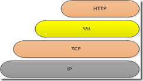
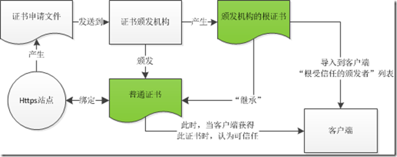

# HTTPS、SSL与数字证书

在互联网安全通信方式上，目前用的最多的就是https配合ssl和数字证书来保证传输和认证安全了。本文追本溯源围绕这个模式谈一谈。

#### 名词解释

首先解释一下上面的几个名词：

__https__：在http(超文本传输协议)基础上提出的一种安全的http协议，因此可以称为安全的超文本传输协议。http协议直接放置在TCP协议之上，而https提出在http和TCP中间加上一层加密层。从发送端看，这一层负责把http的内容加密后送到下层的TCP，从接收方看，这一层负责将TCP送来的数据解密还原成http的内容。

__SSL__(Secure Socket Layer)：是Netscape公司设计的主要用于WEB的安全传输协议。从名字就可以看出它在https协议栈中负责实现上面提到的加密层。因此，一个https协议栈大致是这样的：

__数字证书__：一种文件的名称，好比一个机构或人的签名，能够证明这个机构或人的真实性。其中包含的信息，用于实现上述功能。

__加密和认证__：加密是指通信双方为了防止铭感信息在信道上被第三方窃听而泄漏，将明文通过加密变成密文，如果第三方无法解密的话，就算他获得密文也无能为力；认证是指通信双方为了确认对方是值得信任的消息发送或接受方，而不是使用假身份的骗子，采取的确认身份的方式。只有同时进行了加密和认真才能保证通信的安全，因此在SSL通信协议中这两者都被应。

因此，这三者的关系已经十分清楚了：https依赖一种实现方式，目前通用的是SSL，数字证书是支持这种安全通信的文件。另外有SSL衍生出TLS和WTLS，前者是IEFT将SSL标准化之后产生的（TSL1.0），与SSL差别很小，后者是用于无线环境下的TSL。

#### 如何加密

常用的加密算法：

* 对称密码算法：是指加密和解密使用相同的密钥，典型的有DES、RC5、IDEA（分组加密），RC4（序列加密）；
* 非对称密码算法：又称为公钥加密算法，是指加密和解密使用不同的密钥（公开的公钥用于加密，私有的私钥用于解密）。比如A发送，B接收，A想确保消息只有B看到，需要B生成一对公私钥，并拿到B的公钥。于是A用这个公钥加密消息，B收到密文后用自己的与之匹配的私钥解密即可。反过来也可以用私钥加密公钥解密。也就是说对于给定的公钥有且只有与之匹配的私钥可以解密，对于给定的私钥，有且只有与之匹配的公钥可以解密。典型的算法有RSA，DSA，DH；
* 散列算法：散列变换是指把文件内容通过某种公开的算法，变成固定长度的值（散列值），这个过程可以使用密钥也可以不使用。这种散列变换是不可逆的，也就是说不能从散列值变成原文。因此，散列变换通常用于验证原文是否被篡改。典型的算法有：MD5，SHA，Base64，CRC等。

在散列算法（也称摘要算法）中，有两个概念，强无碰撞和弱无碰撞。弱无碰撞是对给定的消息x，就是对你想伪造的明文，进行运算得出相同的摘要信息。也就是说你可以控制明文的内容。强无碰撞是指能找到相同的摘要信息，但伪造的明文是什么并不知道。

SSL的加密过程：

需要注意的是非对称加解密算法的效率要比对称加解密要低的多。所以SSL在握手过程中使用非对称密码算法来协商密钥，实际使用对称加解密的方法对http内容加密传输。下面是对这一过程的形象的比喻：

假设A与B通信，A是SSL客户端，B是SSL服务器端，加密后的消息放在方括号[]里，以突出明文消息的区别。双方的处理动作的说明用圆括号（）括起。

* A：我想和你安全的通话，我这里的对称加密算法有DES,RC5,密钥交换算法有RSA和DH，摘要算法有MD5和SHA。
* B：我们用DES－RSA－SHA这对组合好了。这是我的证书，里面有我的名字和公钥，你拿去验证一下我的身份（把证书发给A）。
* A：（查看证书上B的名字是否无误，并通过手头早已有的数字的证书验证了B的证书的真实性，如果其中一项有误，发出警告并断开连接，这一步保证了B的公钥的真实性）
* （产生一份秘密消息，这份秘密消息处理后将用作对称加密密钥，加密初始化向量和hmac的密钥。将这份秘密消息-协议中称为per_master_secret-用B的公钥加密，封装成称作ClientKeyExchange的消息。由于用了B的公钥，保证了第三方无法窃听）
* 我生成了一份秘密消息，并用你的公钥加密了，给你（把ClientKeyExchange发给B）
* 注意，下面我就要用加密的办法给你发消息了！
* （将秘密消息进行处理，生成加密密钥，加密初始化向量和hmac的密钥）
* [我说完了]
* B：（用自己的私钥将ClientKeyExchange中的秘密消息解密出来，然后将秘密消息进行处理，生成加密密钥，加密初始化向量和hmac的密钥，这时双方已经安全的协商出一套加密办法了）
* 注意，我也要开始用加密的办法给你发消息了！
* [我说完了]
* A: [我的秘密是...]
* B: [其它人不会听到的...]

从上面的过程可以看到，SSL协议是如何用非对称密码算法来协商密钥，并使用密钥加密明文并传输的。还有以下几点补充：

1. B使用数字证书把自己的公钥和其他信息包装起来发送A，A验证B的身份，下面会谈到A是如何验证的。
2. A生成了了加密密钥、加密初始化向量和hmac密钥是双方用来将明文摘要和加密的。加密初始化向量和hmac密钥首先被用来对明文摘要（防止明文被篡改），然后这个摘要和明文放在一起用加密密钥加密后传输。
3. 由于只有B有私钥，所以只有B可以解密ClientKeyExchange消息，并获得之后的通信密钥。
4. 事实上，上述过程B没有验证A的身份，如果需要的话，SSL也是支持的，此时A也需要提供自己的证书，这里就不展开了。在设置IIS的SSL Require的时候，通常默认都是igore client certification的。

#### 数字证书

由上面的讨论可以知道，数字证书在ssl传输过程中扮演身份认证和密钥分发的功能。究竟什么是数字证书呢？

简而言之数字证书是一种网络上证明持有者身份的文件，同时还包含有公钥。一方面，既然是文件那么就有可能"伪造"，因此，证书的真伪就需要一个验证方式；另一方面，验证方需要认同这种验证方式。

对于第一个需求，目前的解决方案是，证书可以由国际上公认的证书机构颁发，这些机构是公认的信任机构，一些验证证书的客户端应用程序：比如浏览器，邮件客户端等，对于这些机构颁发的证书完全信任。当然想要请这些机构颁发证书可是要付"到了斯"的，通常在windows部署系统的时候会让客户端安装我们自己服务器的根证书，这样客户端同样可以信任我们的证书。

对于第二个需求，客户端程序通常通过维护一个"根受信任机构列表"，当收到一个证书时，查看这个证书是否是该列表中的机构颁发的，如果是则这个证书是可信任的，否则就不信任。

__证书的信任__

因此作为一个https的站点需要与一个证书绑定，无论如何，证书总是需要一个机构颁发的，这个机构可以是国际公认的证书机构，也可以是任何一台安装有证书服务的计算机。客户端是否能够信任这个站点的证书，首先取决于客户端程序是否导入了证书颁发者的根证书。下图说明了这个流程：

有时一个证书机构可能授权另一个证书机构颁发证书，这样就出现了证书链。

IE浏览器在验证证书的时候主要从下面三个方面考察，只要有任何一个不满足都将给出警告：

* 证书的颁发者是否在"根受信任的证书颁发机构列表"中
* 证书是否过期
* 证书的持有者是否和访问的网站一致

另外，浏览器还会定期查看证书颁发者公布的"证书吊销列表"，如果某个证书虽然符合上述条件，但是被它的颁发者在"证书吊销列表"中列出，那么也将给出警告。每个证书的CRL Distribution Point字段显示了查看这个列表的url。尽管如此，windows对于这个列表是"不敏感"的，也就是说windows的api会缓存这个列表，直到设置的缓存过期才会再从CRL Distribution Point中下载新的列表。目前，只能通过在证书颁发服务端尽量小的设置这个有效期（最小1天），来尽量使windows的客户端"敏感"些。

要实现ssl加密通信，必须要双方协商密钥，ssl采用的是非对称加密来实现密钥交换。在这个过程中，服务端向客户端发送的公钥就包含在证书中。客户端将自己生成的密钥用公钥加密，服务端用于公钥匹配的私钥解密。因此，可以想到的是，服务端保存了一个私钥，并且也与https的站点绑定了。
